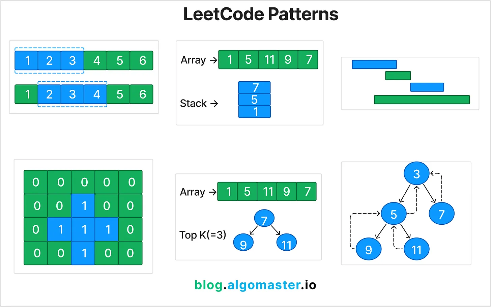

## 1. Soma do prefixo (PrefixSum)

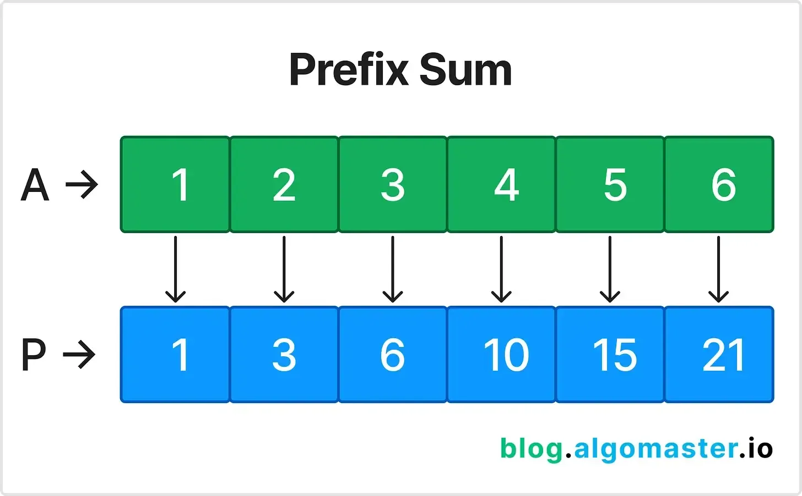

A soma do prefixo envolve o **pré-processamento** de uma matriz para criar uma nova matriz em que cada elemento no índice representa a soma da matriz desde o início até . Isso permite consultas de soma eficientes em **subarrays**.ii

Use esse padrão quando precisar executar várias consultas de soma em um subarray ou calcular somas cumulativas.

### Exemplo de problema:
Dada uma matriz , responda a várias perguntas sobre a soma dos elementos dentro de um intervalo específico .nums[i, j]

**Exemplo:**

* **Entrada:** `nums = [1, 2, 3, 4, 5, 6]`, `i = 1`, `j = 3`

* **Saída:** 9

### Explicação:
1. Pré-processe a matriz para criar uma matriz de soma de prefixo: AP = `[1, 3, 6, 10, 15, 21]`

2. Para encontrar a soma entre índices use a fórmula: `ijP[j] - P[i-1]`

## 2. Dois ponteiros (Two Pointers)

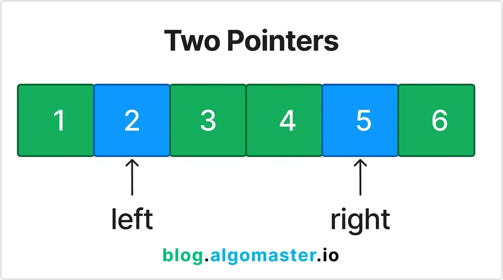

O padrão Dois Ponteiros envolve o uso de dois ponteiros para iterar por meio de uma matriz ou lista, geralmente usada para localizar **pares ou elementos** que atendam a critérios específicos.

Use esse padrão ao lidar com matrizes ou listas classificadas em que você precisa encontrar pares que satisfaçam uma condição específica.

### Exemplo de problema:
Encontre dois números em uma matriz classificada que somam um valor de destino.

**Exemplo:**

* **Entrada:** `nums = [1, 2, 3, 4, 6]`, `target = 6`

* **Saída:** `[1, 3]`

### Explicação:
1. Inicialize dois ponteiros, um no início () e outro no final () da matriz.leftright

2. Verifique a soma dos elementos nos dois ponteiros.

3. Se a soma for igual ao destino, retorne os índices.

4. Se a soma for menor que o alvo, mova o ponteiro esquerdo para a direita.

5. Se a soma for maior que o alvo, mova o ponteiro direito para a esquerda.

## 3. Janela deslizante (Sliding Window)

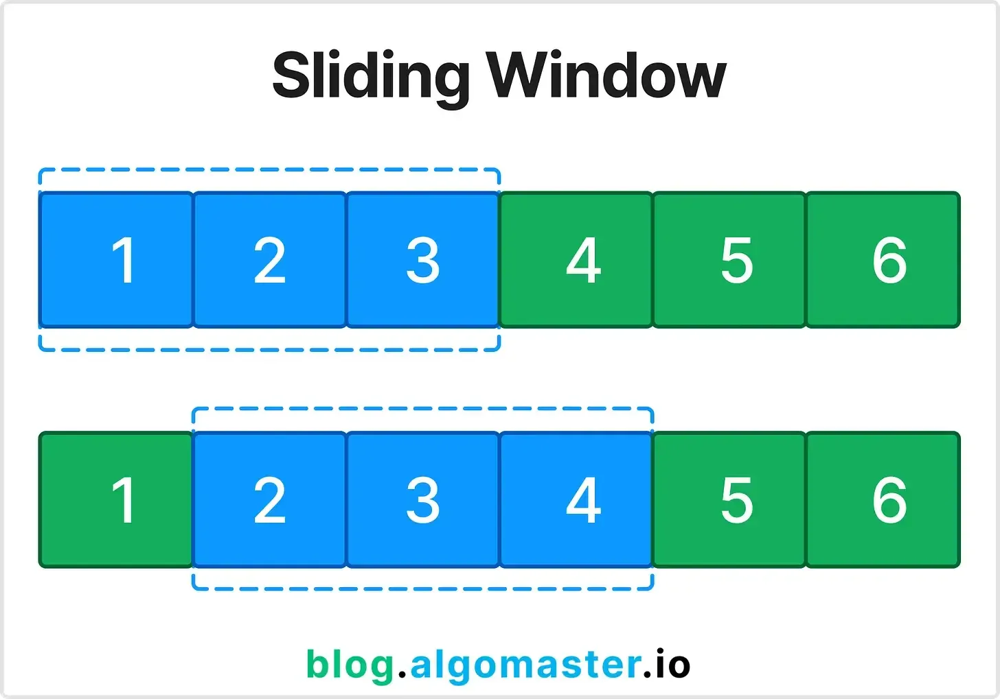

O padrão Janela Deslizante é usado para encontrar uma submatriz ou substring que satisfaça uma condição específica, otimizando a complexidade do tempo mantendo uma janela de elementos.

Use esse padrão ao lidar com problemas envolvendo subarrays ou substrings contíguos.

### Exemplo de problema:
Encontre a soma máxima de um subarray de tamanho . k

**Exemplo:**

* **Entrada:** `nums = [2, 1, 5, 1, 3, 2]`, `k = 3`

* **Saída:** `9`

### Explicação:
1. Comece com a soma dos primeiros elementos. k

2. Deslize a janela um elemento de cada vez, subtraindo o elemento que sai da janela e adicionando o novo elemento.

3. Acompanhe a soma máxima encontrada.

## 4. Ponteiros rápidos e lentos (Fast & Slow Pointers)

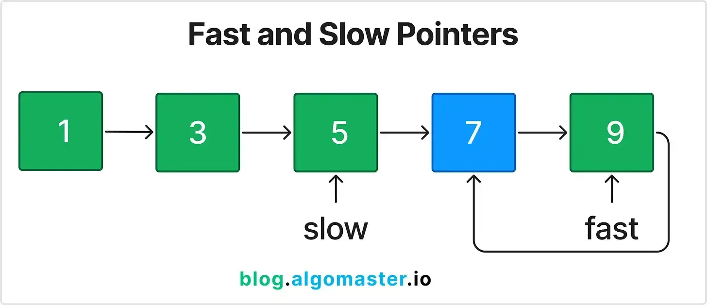

O padrão de Ponteiros Rápidos e Lentos (Tartaruga e Lebre) é usado para detectar ciclos em listas encadeadas e outras estruturas semelhantes.

### Exemplo de problema:
Detecte se uma lista encadeada tem um ciclo.

### Explicação:
1. Inicialize dois ponteiros, um movendo um passo de cada vez (lento) e o outro movendo dois passos de cada vez (rápido).

2. Se houver um ciclo, o ponteiro rápido acabará encontrando o ponteiro lento.

3. Se o ponteiro rápido chegar ao final da lista, não haverá ciclo.

## 5. Reversão in-loco do LinkedList (LinkedList In-place Reversal)

A reversão in-loco de um padrão LinkedList reverte partes de uma lista vinculada sem usar espaço extra.

Use esse padrão quando precisar inverter seções de uma lista encadeada.

### Exemplo de problema:
Inverta uma sublista de uma lista vinculada da posição.

**Exemplo:**

* **Entrada:** `head = [1, 2, 3, 4, 5]`, `m = 2`, `n = 4`

* **Saída:** `[1, 4, 3, 2, 5]`

### Explicação:
1. Identifique o início e o fim da sublista.

2. Inverta os nós no lugar ajustando os ponteiros.

## 6. Pilha monotônica (Monotonic Stack)

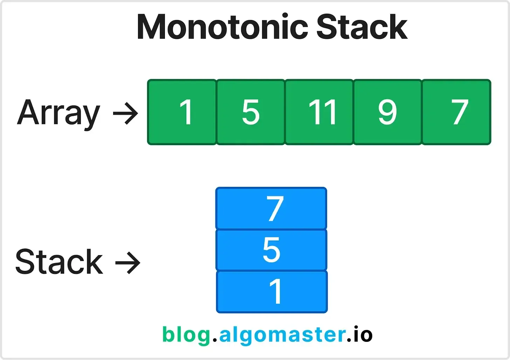

O padrão Pilha monotônica usa uma pilha para manter uma sequência de elementos em uma ordem específica (crescente ou decrescente).

Use esse padrão para problemas que exigem encontrar o próximo elemento maior ou menor.

### Exemplo de problema:
Encontre o próximo elemento maior para cada elemento em uma matriz. Saída -1 se o elemento maior não existir.

**Exemplo:**

* **Entrada:** `nums = [2, 1, 2, 4, 3]`

* **Saída:** `[4, 2, 4, -1, -1]`

### Explicação:
1. Use uma pilha para acompanhar os elementos para os quais ainda não encontramos o próximo elemento maior.

2. Itere pela matriz e, para cada elemento, retire os elementos da pilha até encontrar um elemento maior.

3. Se a pilha não estiver vazia, defina o resultado do índice na parte superior da pilha para o elemento atual.

4. Empurre o elemento atual para a pilha.

## 7. Principais elementos 'K' (Top 'K' Elements)

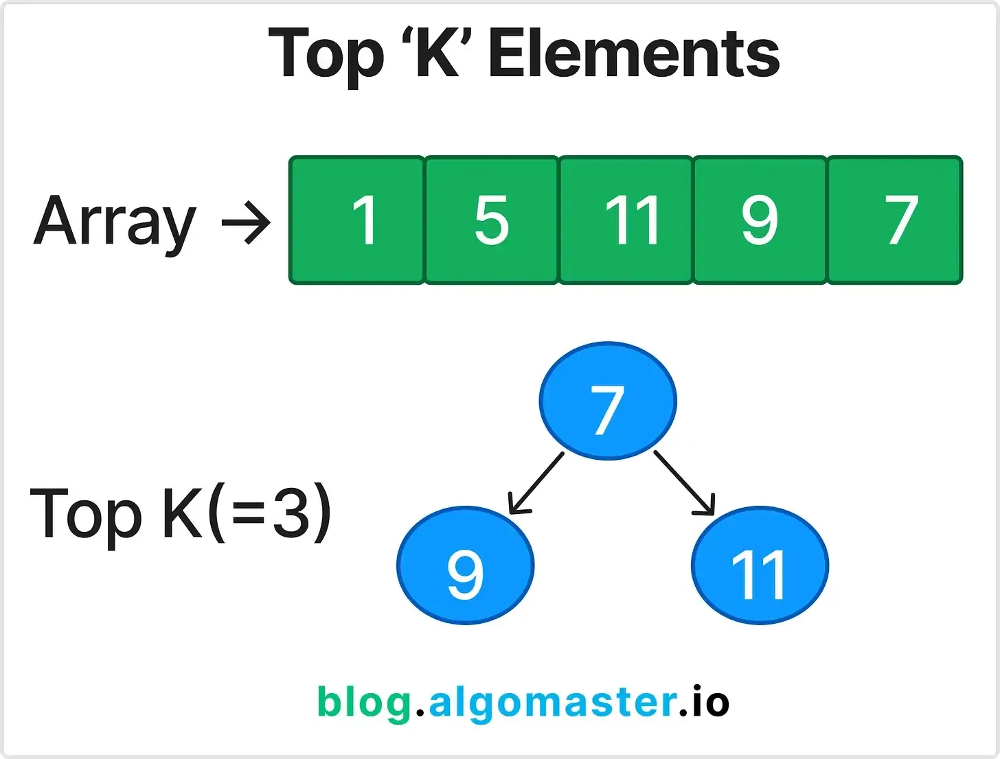

O padrão Top 'K' Elements localiza os k principais elementos maiores ou menores em uma matriz ou fluxo de dados usando heaps ou classificação.

### Exemplo de problema:
Encontre o k-ésimo maior elemento em uma matriz não classificada.

**Exemplo:**

* **Entrada:** `nums = [3, 2, 1, 5, 6, 4]`, `k = 2`

* **Saída:** `5`

### Explicação:
1. Use um min-heap de tamanho k para acompanhar os k maiores elementos.

2. Itere pela matriz, adicionando elementos ao heap.

3. Se o tamanho do heap exceder k, remova o menor elemento do heap.

4. A raiz do heap será o k-ésimo maior elemento.

## 8. Intervalos sobrepostos (Overlapping Intervals)

O padrão Intervalos Sobrepostos é usado para mesclar ou manipular intervalos sobrepostos em uma matriz.

Em uma lista de intervalos ordenada pelo tempo de início (ou seja, assumindo a ≤ c), dois intervalos [a, b] e [c, d] se sobrepõem quando b ≥ c — isto é, o término do primeiro alcança ou ultrapassa o início do segundo (considerando intervalos fechados).  
Quando há sobreposição, eles podem ser mesclados em um único intervalo [a, max(b, d)].  

### Exemplo de problema:
Declaração do problema: mescle todos os intervalos sobrepostos.

* **Entrada:** `intervals = [[1, 3], [2, 6], [8, 10], [15, 18]]`

* **Saída:** `[[1, 6], [8, 10], [15, 18]]`

### Explicação:
1. Classifique os intervalos pela hora de início.

2. Crie uma lista vazia chamada para armazenar os intervalos mesclados.merged

3. Itere pelos intervalos e verifique se ele se sobrepõe ao último intervalo da lista.merged

4. Se ele se sobrepor, mescle os intervalos atualizando a hora de término do último intervalo em .merged

5. Se não se sobrepuser, basta adicionar o intervalo atual à lista.merged

## 9. Pesquisa binária modificada (Modified Binary Search)

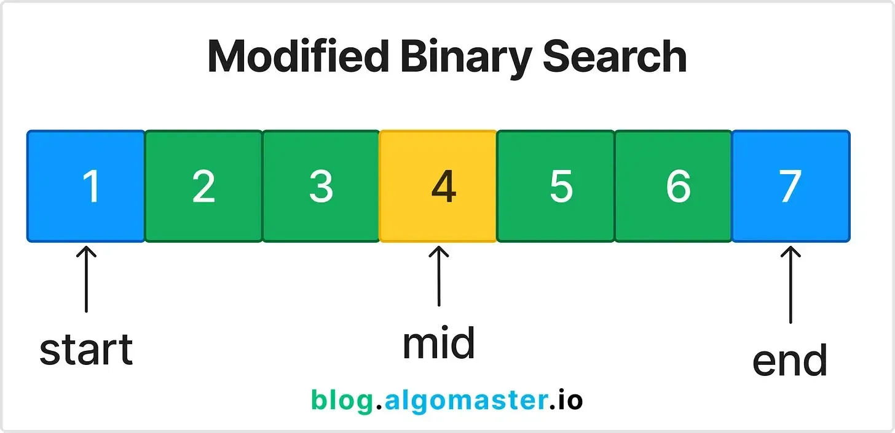

O padrão de pesquisa binária modificada adapta a pesquisa binária para resolver uma gama mais ampla de problemas, como encontrar elementos em matrizes ordenadas giradas.

Use esse padrão para problemas envolvendo matrizes classificadas ou giradas em que você precisa encontrar um elemento específico.

### Exemplo de problema:
Encontre um elemento em uma matriz classificada girada.

**Exemplo:**

* **Entrada:** `nums = [4, 5, 6, 7, 0, 1, 2]`, `target = 0`

* **Saída:** `4`

### Explicação:
1. Execute a pesquisa binária com uma verificação adicional para determinar qual metade da matriz está classificada.

2. Em seguida, verificamos se o alvo está dentro do intervalo da metade classificada.

3. Se for, procuramos essa metade; caso contrário, pesquisamos a outra metade.

## 10. Travessia da árvore binária (Binary Tree Traversal)

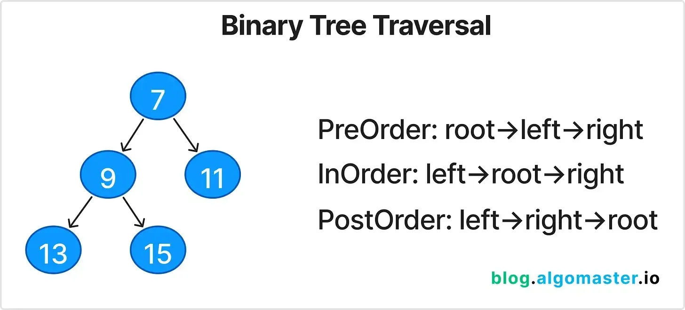

A Travessia da Árvore Binária envolve visitar todos os nós em uma árvore binária em uma ordem específica.

* Pré-encomenda: root -> left -> right

* Em ordem: left -> root -> right

* Pós-encomenda: left -> right -> root

### Exemplo de problema:
Declaração do problema: Execute a travessia de ordem de uma árvore binária.

**Exemplo:**

* **Entrada:** `root = [1, null, 2, 3]`

* **Saída:** `[1, 3, 2]`

### Explicação:
1. A travessia em ordem visita os nós na ordem: esquerda, raiz, direita.

2. Use recursão ou uma pilha para percorrer a árvore nesta ordem.

## 11. Pesquisa em profundidade (Depth-First Search DFS)

A pesquisa em profundidade (DFS) é uma técnica de travessia que explora o mais longe possível em uma ramificação antes de retroceder.

Use esse padrão para explorar todos os caminhos ou ramificações em gráficos ou árvores.

### Exemplo de problema:
Encontre todos os caminhos da raiz às folhas em uma árvore binária.

**Exemplo:**

* **Entrada:** `root = [1, 2, 3, null, 5]`

* **Saída:** `["1->2->5", "1->3"]`

### Explicação:
1. Use recursão ou uma pilha para percorrer cada caminho da raiz até as folhas.

2. Registre cada caminho à medida que você atravessa.

## 12. Pesquisa em largura (Breadth-First Search BFS)

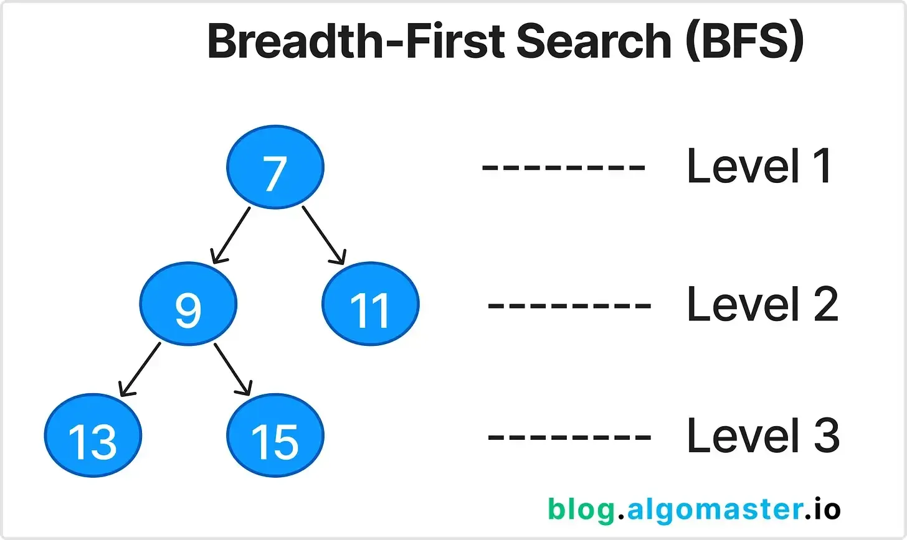

A pesquisa em largura (BFS) é uma técnica transversal que explora nós nível por nível em uma árvore ou gráfico.

Use esse padrão para encontrar os caminhos mais curtos em gráficos não ponderados ou passagem de ordem de nível em árvores.

### Exemplo de problema:
Execute a travessia de ordem de nível de uma árvore binária.

**Exemplo:**

* **Entrada:** `root = [3, 9, 20, null, null, 15, 7]`

* **Saída:** `[[3], [9, 20], [15, 7]]`

### Explicação:
Use uma fila para acompanhar os nós em cada nível.

Percorra cada nível e adicione os filhos dos nós atuais à fila.

## 13. Travessia da Matriz (Matrix Traversal)

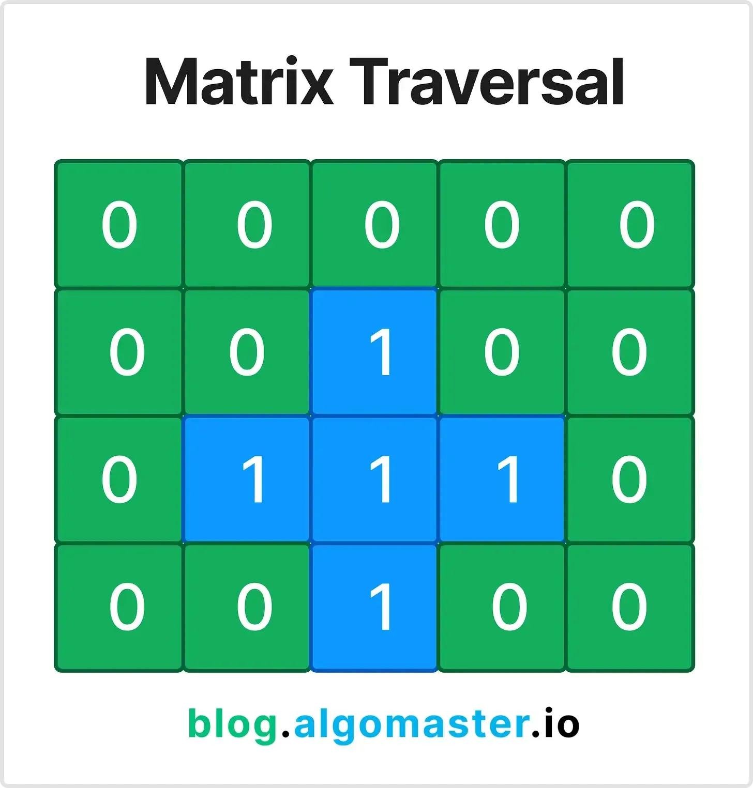

A travessia de matriz envolve a travessia de elementos em uma matriz usando diferentes técnicas (DFS, BFS, etc.).

Use esse padrão para problemas que envolvem a travessia de grades ou matrizes 2D horizontalmente, verticalmente ou diagonalmente.

### Exemplo de problema:
Execute o preenchimento de inundação em uma grade 2D. Altere todas as células conectadas à célula inicial para uma nova cor.

**Exemplo:**

* **Entrada:** `image = [[1,1,1],[1,1,0],[1,0,1]]`, `sr = 1`, `sc = 1`, `newColor = 2`

* **Saída:** `[[2,2,2],[2,2,0],[2,0,1]]`

### Explicação:
1. Use DFS ou BFS para percorrer a matriz a partir da célula fornecida.

2. Altere a cor das células conectadas para a nova cor.

## 14. Retrocesso (Backtracking)

O retrocesso explora todas as soluções possíveis e retrocede quando um caminho de solução falha.

Use esse padrão quando precisar encontrar todas (ou algumas) soluções para um problema que satisfaça determinadas restrições. Por **Exemplo:** problemas combinatórios, como gerar permutações, combinações ou subconjuntos.

### Exemplo de problema:
Gere todas as permutações de uma determinada lista de números.

**Exemplo:**

* **Entrada:** `nums = [1, 2, 3]`

* **Saída:** `[[1,2,3], [1,3,2], [2,1,3], [2,3,1], [3,1,2], [3,2,1]]`

### Explicação:
1. Use a recursão para gerar permutações.

2. Para cada elemento, inclua-o na permutação atual e gere recursivamente as permutações restantes.

3. Retroceder quando todas as permutações para um determinado caminho forem geradas.

## 15. Padrões de programação dinâmica (Dynamic Programming Patterns)
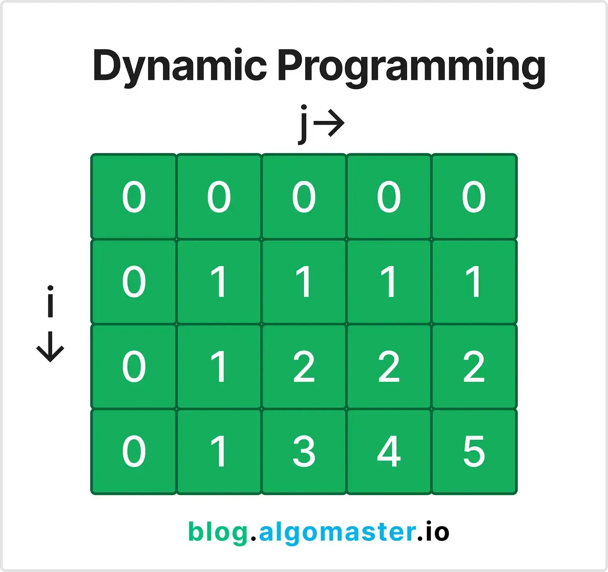
A Programação Dinâmica (DP) envolve dividir os problemas em subproblemas menores e resolvê-los usando uma abordagem de baixo para cima ou de cima para baixo.

Use esse padrão para problemas com subproblemas sobrepostos e subestrutura ideal.

O próprio DP tem vários subpadrões. Alguns dos mais importantes são:

* Números de Fibonacci
* 0/1 Mochila
* Subsequência comum mais longa (LCS)
* Subsequência crescente mais longa (LIS)
* Soma do subconjunto
* Multiplicação de Cadeia de Matrizes

### Exemplo de problema:
Calcule o n-th número de Fibonacci.

**Exemplo:**

* **Entrada:** `n = 5`

* **Saída:** `(Os primeiros cinco números de Fibonacci são 0, 1, 1, 2, 3, 5) 5`

### Explicação:
1. Use uma abordagem de baixo para cima para calcular o n-ésimo número de Fibonacci.

2. Comece com os dois primeiros números (0 e 1) e itere para calcular os próximos números como .(dp[i] = dp[i - 1] + dp[i - 2])

### Link Original:
- https://blog.algomaster.io/p/15-leetcode-patterns